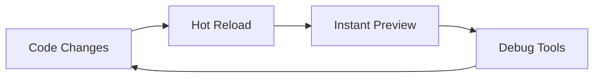

# ONE Assistant Framework Developer Experience

## 1. Quick Start Guide

### Installation
```bash
# Create new ONE project
pnpm create one-app my-ai-app

# Install dependencies
cd my-ai-app
pnpm install

# Start development server
pnpm dev
```

### Basic Usage
```tsx
// pages/chat.tsx
import { ONE } from '@one/core';
import { Thread } from '@one/ui';

export default function ChatPage() {
  return (
    <ONE.Provider>
      <Thread 
        welcome={{
          message: "How can I help?",
          suggestions: ["Start coding", "Debug issue"]
        }}
      />
    </ONE.Provider>
  );
}
```

## 2. Development Workflow

### Local Development


### Debug Tools
```typescript
// Enable debug mode
const runtime = useONERuntime({
  debug: {
    logLevel: 'verbose',
    devTools: true,
    networkPanel: true
  }
});
```

## 3. Common Patterns

### Error Handling
```typescript
try {
  await runtime.executeTool('database', params);
} catch (error) {
  if (error instanceof ToolExecutionError) {
    // Handle tool-specific errors
    logger.error('Tool execution failed:', {
      tool: error.toolName,
      params: error.params,
      reason: error.reason
    });
  } else if (error instanceof NetworkError) {
    // Handle network issues
    retryWithBackoff(async () => {
      await runtime.executeTool('database', params);
    });
  }
}
```

### State Management
```typescript
// Custom hook for thread management
function useThreadState() {
  const [state, setState] = useState({
    messages: [],
    isTyping: false,
    error: null
  });

  const addMessage = useCallback((message) => {
    setState(prev => ({
      ...prev,
      messages: [...prev.messages, message]
    }));
  }, []);

  return {
    state,
    addMessage,
    // ... other methods
  };
}
```

## 4. Performance Tips

### Message Virtualization
```tsx
// Efficient message rendering
import { VirtualScroll } from '@one/ui';

function MessageList({ messages }) {
  return (
    <VirtualScroll
      items={messages}
      height={600}
      itemHeight={80}
      overscan={5}
      renderItem={(message) => (
        <Message key={message.id} {...message} />
      )}
    />
  );
}
```

### Memory Management
```typescript
// Automatic cleanup
useEffect(() => {
  const cleanup = runtime.subscribe((state) => {
    if (state.messages.length > 1000) {
      runtime.pruneMessages({
        keepLast: 100,
        preserveContext: true
      });
    }
  });

  return cleanup;
}, [runtime]);
```

## 5. Tool Development

### Tool Template
```typescript
import { createTool } from '@one/tools';

export const customTool = createTool({
  name: 'myTool',
  description: 'Custom tool description',
  
  // Define input schema
  parameters: {
    param1: {
      type: 'string',
      description: 'First parameter'
    },
    param2: {
      type: 'number',
      optional: true
    }
  },

  // Implementation
  async execute({ param1, param2 }) {
    // Tool logic here
    return {
      result: 'Success',
      metadata: { /* ... */ }
    };
  }
});
```

### Tool Testing
```typescript
describe('customTool', () => {
  it('handles valid input', async () => {
    const result = await customTool.execute({
      param1: 'test',
      param2: 42
    });
    
    expect(result).toMatchSnapshot();
  });

  it('validates parameters', () => {
    expect(() => {
      customTool.execute({
        param1: null // should be string
      });
    }).toThrow(ValidationError);
  });
});
```

## 6. Deployment Guide

### Environment Setup
```bash
# Production environment variables
ONE_API_KEY=xxx
ONE_MODEL=gpt-4o-mini
ONE_TOOLS_ENABLED=true
ONE_MAX_TOKENS=4096
```

### Build Process
```bash
# Production build
pnpm build

# Type checking
pnpm type-check

# Run tests
pnpm test

# Deploy
pnpm deploy
```

### Monitoring Setup
```typescript
// Initialize monitoring
const monitoring = new ONEMonitoring({
  metrics: {
    responseTime: true,
    errorRate: true,
    tokenUsage: true
  },
  alerts: {
    errorThreshold: 0.1, // 10% error rate
    responseTimeThreshold: 2000 // 2 seconds
  }
});

// Attach to runtime
runtime.use(monitoring);
```

## 7. Best Practices

### Code Organization
```
src/
├── components/
│   ├── Thread/
│   │   ├── index.tsx
│   │   ├── Message.tsx
│   │   └── Composer.tsx
│   └── Tools/
│       ├── index.ts
│       └── CustomTool.tsx
├── hooks/
│   ├── useThread.ts
│   └── useTools.ts
├── utils/
│   ├── api.ts
│   └── validation.ts
└── types/
    └── index.ts
```

### Type Safety
```typescript
// Define strict types
interface Message {
  id: string;
  content: string;
  role: 'user' | 'assistant';
  timestamp: Date;
  metadata?: Record<string, unknown>;
}

// Use type guards
function isAssistantMessage(
  message: Message
): message is AssistantMessage {
  return message.role === 'assistant';
}
```

Remember: This documentation is living and should be updated as the framework evolves. Contributions and feedback are welcome!