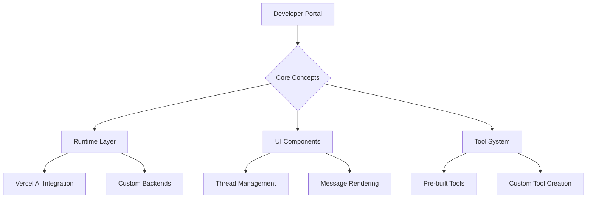
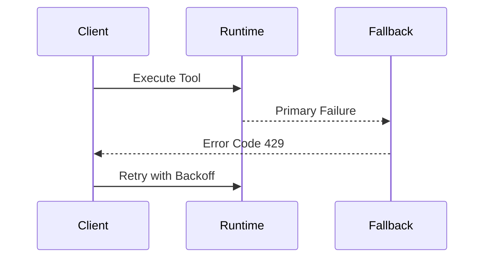

# ONE Assistant Framework Documentation Plan

## 1. Architectural Overview


## 2. Core Components
```tsx
// Runtime Configuration Example
export const config = createRuntime({
  model: openai('gpt-4-turbo'),
  tools: [webSearch, codeInterpreter],
  ui: {
    messageComponents: {
      text: MarkdownRenderer,
      tool: ToolCallPreview,
    }
  }
});
```

## 3. Getting Started Guide
1. **Runtime Setup**
   ```bash
   npx one-cli init --template vercel-ai
   ```
2. **UI Integration**
   ```tsx
   export default function ChatPage() {
     return (
       <RuntimeProvider config={config}>
         <ThreadLayout 
           composer={<SmartComposer />}
           header={<CustomHeader />}
         />
       </RuntimeProvider>
     )
   }
   ```

## 4. Advanced Features
**Multi-Modal Processing Pipeline**
```
User Input → Text Normalization → Intent Recognition → Tool Selection → 
AI Processing → Response Generation → UI Rendering
```

**Performance Optimization**
```ts
// Streaming Prioritization
const channel = createChannel({
  priority: ['text', 'quick_actions', 'tool_calls'],
  bufferSize: 1024,
  throttle: 16ms 
});
```

## 5. API Reference
**Core Runtime Methods**
| Method                | Description                     | Complexity |
|-----------------------|---------------------------------|------------|
| `runtime.threads.create()` | Initialize new conversation | O(1)       |
| `runtime.tools.execute()`  | Run tool with validation   | O(n log n) |

**Edge Cases Handling**
```ts
try {
  await tool.execute(request);
} catch (error) {
  if (error instanceof RateLimitError) {
    retryWithExponentialBackoff();
  }
}
```

## 6. Best Practices
**Error Resilient Architecture**


## 7. Troubleshooting
**Common Issues Matrix**
| Symptom               | Likely Cause          | Solution               |
|-----------------------|-----------------------|------------------------|
| Stalled Stream        | Buffer Overflow       | Increase channelSize   |
| Tool Call Timeout     | Missing Permissions   | Check IAM Roles        |
| UI Flickering         | State Race Condition  | Use useTransition()    |

## 8. Roadmap
```json
{
  "Q3 2024": ["Tool Versioning", "Cost Tracking"],
  "Q4 2024": ["Multi-Model Orchestration", "Audit Logs"],
  "2025": ["Visual Workflow Builder", "LLM Firewall"]
}
