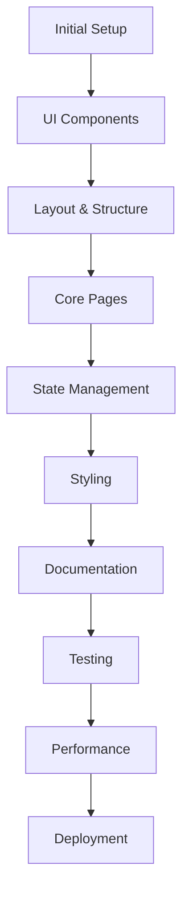

Let's break this down into a strategic approach. Given your goals, here's what I recommend:

1. **Start with Core Foundation (Website First)**
```typescript:1/1.ts
// Core system that everything builds upon
export class ONE {
  version = '1.0.0'
  
  // System-wide configuration
  config = {
    mode: 'development',
    baseUrl: '/',
    debug: true
  }

  // Core initialization
  constructor() {
    this.init()
  }

  private init() {
    // Initialize core systems
  }
}
```


**Why This Order:**
1. Website First:
   - Gives us a visual interface to work with
   - Provides immediate feedback
   - Can watch the system grow
   - Tests our component architecture

2. Collection System Next:
   - Allows us to gather data from existing sites
   - Builds our knowledge base
   - Provides training data for agents
   - Tests our data structures

3. Then Agents:
   - Built with real data
   - Have a UI to interact with
   - Can see their effects
   - Can be tested against real scenarios

**Initial Focus:**
```typescript:1/website/pages/system.tsx
import { ONE } from '../1'
import { Layout, Card, Button } from '../components'

export default function SystemDashboard() {
  return (
    <Layout>
      <Card>
        <h2>System Status</h2>
        {/* System metrics */}
      </Card>
      <Card>
        <h2>Data Collection</h2>
        {/* Collection controls */}
      </Card>
      <Card>
        <h2>Agent Status</h2>
        {/* Future agent metrics */}
      </Card>
    </Layout>
  )
}
```

This approach:
1. Builds foundation first
2. Creates immediate value
3. Makes development visible
4. Enables iterative improvement
5. Keeps motivation high

The complete process of creating an Astro website based on your todo list and the ONE system architecture. Here's a structured approach:



Let's break down each phase with specific tasks and code examples:

## 1. Initial Setup

```bash
# Clone the ONE template
git fork https://github.com/one-ie/one.git

# Install core dependencies
pnpm add @astrojs/react @astrojs/tailwind tailwindcss
pnpm add -D @types/react @types/react-dom
pnpm add lucide-react class-variance-authority clsx tailwind-merge

# Configure Astro
```

````typescript:astro.config.mjs
import { defineConfig } from 'astro'
import react from '@astrojs/react'
import tailwind from '@astrojs/tailwind'

export default defineConfig({
  integrations: [react(), tailwind()],
  output: 'server'
})
````

## 2. UI Components Setup

```bash
# Initialize shadcn-ui
pnpm dlx shadcn-ui@latest init
```

````typescript:src/components/ui/button.tsx
// Add core components one by one
pnpm dlx shadcn-ui@latest add button
pnpm dlx shadcn-ui@latest add card
pnpm dlx shadcn-ui@latest add dropdown
// ... etc
````

## 3. Layout & Structure

````astro:src/layouts/Layout.astro
---
import { ViewTransitions } from 'astro:transitions'
import { ThemeProvider } from '@/components/theme-provider'
---

<html lang="en">
  <head>
    <meta charset="utf-8" />
    <ViewTransitions />
  </head>
  <body>
    <ThemeProvider>
      <slot />
    </ThemeProvider>
  </body>
</html>
````

## 4. Core Pages

````astro:src/pages/index.astro
---
import Layout from '@/layouts/Layout.astro'
import { ONE } from '@/1'
import Page from index.json
import { Hero } from '@/components/Hero'
import { Features } from '@/components/Features'

---

<Layout>
  <Hero />
  <Features />
</Layout>
````

## 5. State Management

````typescript:src/lib/store/theme.ts
import { atom } from 'nanostores'

export const themeStore = atom<'light' | 'dark'>('light')

export function toggleTheme() {
  themeStore.set(themeStore.get() === 'light' ? 'dark' : 'light')
}
````

## 6. Styling

````css:src/styles/globals.css
@tailwind base;
@tailwind components;
@tailwind utilities;
 
@layer base {
  :root {
    --background: 0 0% 100%;
    --foreground: 222.2 84% 4.9%;
    /* ... other variables */
  }
}
````

## 7. Documentation

````mdx:src/content/docs/getting-started.mdx
---
title: Getting Started
description: Learn how to get started with our platform
---

# Getting Started

Welcome to our documentation...
````

## 8. Testing

````typescript:src/components/Button.test.ts
import { test, expect } from 'vitest'
import { render, screen } from '@testing-library/react'
import { Button } from './Button'

test('Button renders correctly', () => {
  render(<Button>Click me</Button>)
  expect(screen.getByRole('button')).toBeInTheDocument()
})
````

## 9. Performance

````typescript:src/middleware.ts
import { defineMiddleware } from 'astro:middleware'

export const onRequest = defineMiddleware(async (context, next) => {
  // Add caching headers
  context.response.headers.set('Cache-Control', 'max-age=3600')
  return await next()
})
````

## 10. Deployment

````yaml:vercel.json
{
  "buildCommand": "pnpm build",
  "outputDirectory": "dist",
  "framework": "astro",
  "regions": ["sfo1"]
}
````

## Key Checkpoints

1. **After Initial Setup**
   - Verify Astro config is correct
   - Test TypeScript compilation
   - Confirm dependencies are installed

2. **After UI Setup**
   - Test component library integration
   - Verify theme switching works
   - Check component styling

3. **After Layout Implementation**
   - Test view transitions
   - Verify responsive design
   - Check meta tags

4. **Before Deployment**
   - Run performance audits
   - Complete test coverage
   - Verify build process

## Best Practices

1. **File Organization**
   - Keep components in logical groups
   - Use index files for clean exports
   - Maintain consistent naming

2. **Performance**
   - Use partial hydration wisely
   - Optimize images
   - Implement proper caching

3. **Development Flow**
   - Use Git for version control
   - Follow component-driven development
   - Write tests as you build

This process follows the ONE system's principles of organized, systematic development while leveraging Astro's powerful features for optimal performance and developer experience.
