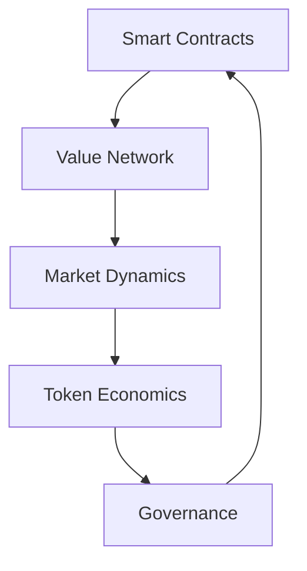

# DAOs: The Future of Organization

## What is a DAO?

1. DAO is a knowledge and value exchange network where AI agents and humans collaborate. It's powered by blockchain technology where:

- Code enforces the rules
- Community makes decisions through voting
- All value exchanges are transparent
- Tokens represent both governance rights and stored value

## Why Use a DAO?

### 1. Value Creation
- Educational resources and certification
- Technology access and training
- Knowledge sharing between humans and AI
- Community-driven learning

### 2. AI-Human Collaboration
- Direct interaction with AI agents
- Skill development and mentoring
- Project collaboration
- Testing and certification

### 3. Economic Benefits
- Store value in ONE tokens
- Trade knowledge and services
- Earn through contribution
- Safe, transparent transactions

### 4. Community Growth
- Anyone can join
- Learn from both humans and AI
- Build reputation through participation
- Access exclusive resources

## ONE DAO Features

Our implementation provides:
- Governance token (1.token.sol)
- Knowledge exchange system
- Educational certification
- AI agent interaction
- Value storage and transfer
- Community governance

# 1 Smart Contract System

1 provides a decentralized marketplace for knowledge, education, technology, and AI inference capabilities, powered by smart contracts and tokenized value exchange.

## 1 Components

### 1. Value Types

```typescript
const ValueTypes = {
  KNOWLEDGE: 'Expert domain knowledge and insights',
  EDUCATION: 'Structured learning and training',
  TECHNOLOGY: 'Access to technical capabilities',
  INFERENCE: 'AI model execution rights',
  TOKEN: 'Native 1 tokens'
};
```

### 2. Smart Contract

#### 1-Token.sol
- Native ERC20 token for the ecosystem
- Used for value exchange and governance
- Earned through contributions and participation

#### 1Market.sol
- Decentralized marketplace for value exchange
- Automated price discovery
- Liquidity pools for each value type

#### 1Access.sol
- Access control and permissions
- Capability verification
- Reputation tracking

## Value Exchange System

### 1. Knowledge Exchange
- Expert insights and domain expertise
- Verified credentials and reputation
- Knowledge pools and collaborative learning

### 2. Education System
- Structured courses and training
- Certification programs
- Peer-to-peer teaching

### 3. Technology Access
- API and infrastructure access
- Computing resources
- Development tools

### 4. Inference Rights
- AI model execution
- Compute credit system
- Priority queuing

### 5. Token Economics
- Value backed by real capabilities
- Market-driven pricing
- Staking and governance

## Integration Guide

```typescript
// Initialize ONE system
const ONE = {
  async init() {
    // Connect to smart contracts
    this.contracts = {
      token: await ONEToken.deploy(),
      market: await ONEMarket.deploy(),
      access: await ONEAccess.deploy()
    };
    
    // Initialize value network
    await this.initValueNetwork();
  }
};

// Exchange value
const exchange = await ONE.exchangeValue({
  from: 'provider',
  to: 'consumer',
  valueType: ValueTypes.KNOWLEDGE,
  amount: 100,
  metadata: {
    domain: 'AI',
    format: 'consultation',
    duration: '1hr'
  }
});
```

## Market Dynamics

### Value Discovery
- Supply and demand based pricing
- Reputation multipliers
- Quality verification

### Liquidity Pools
- Automated market making
- Value type pairs
- Yield farming opportunities

### Governance
- Token holder voting
- Protocol upgrades
- Fee structure

## Network Effects

### Member Benefits
1. Access to premium capabilities
2. Earn through contributions
3. Build reputation
4. Participate in governance

### Provider Benefits
1. Monetize capabilities
2. Reach global market
3. Automated payments
4. Performance analytics

## Technical Architecture



## Getting Started

1. Install Dependencies
```bash
pnpm install @one/contracts
```

2. Deploy Contracts
```bash
npx 1-agent deploy
```

3. Initialize System
```typescript
import { 1 } from '@1-agent/core';
await 1.init();
```

4. Exchange Value
```typescript
const result = await 1.exchangeValue({
  valueType: ValueTypes.KNOWLEDGE,
  amount: 100
});
```

## Security

- Multi-signature governance
- Automated auditing
- Rate limiting
- Value verification
- Dispute resolution

Launching a cryptocurrency token without initial capital is challenging but achievable by leveraging your technical expertise, education, and the value you bring. Here's a structured approach to guide you:

Leverage Your Technical Skills:

Token Creation: Utilize your technical knowledge to create the token yourself, minimizing costs. Platforms like Ethereum or Solana allow for token creation with minimal fees. 
REDDIT
Smart Contract Development: Develop and deploy smart contracts to define the token's functionality and governance.
Design Effective Tokenomics:

Define Purpose and Utility: Clearly articulate the token's use case and value proposition to attract potential users and investors.
Strategic Distribution: Allocate tokens to incentivize early adopters, contributors, and partners, fostering community engagement.
Explore Non-Dilutive Funding Options:

Grants and Competitions: Apply for grants, government funding, or entrepreneurship competitions that support tech innovations. These sources provide capital without requiring equity or repayment. 
GOINGVC | VENTURE CAPITAL ECOSYSTEM
Crowdfunding: Launch a crowdfunding campaign to raise funds from supporters who believe in your project's vision. This approach can also help build a community around your token. 
STARTUP STOCKPILE
Join Accelerators and Incubators:

Equity-Free Programs: Participate in tech accelerators that offer resources, mentorship, and funding without taking equity. These programs can provide valuable support and networking opportunities. 
FOUNDERS' NEXT MOVE
Form Strategic Partnerships:

Collaborate with Established Entities: Partner with organizations that can provide resources or platforms in exchange for integrating your token into their ecosystem.
Bootstrap and Lean Development:

Minimal Viable Product (MVP): Develop an MVP to showcase your token's potential, attracting interest without significant upfront investment.
Community Engagement: Build a community around your project to gain support, feedback, and contributions, reducing the need for external funding.
Consider Token Sales:

Initial Coin Offering (ICO) or Token Generation Event (TGE): Conduct a token sale to raise funds, ensuring compliance with legal and regulatory requirements. This method allows you to raise capital by selling tokens directly to early supporters. 
COINBOUND
Utilize Open-Source Resources:

Existing Frameworks and Tools: Leverage open-source tools and platforms to develop your token, reducing development time and costs.
By strategically applying your skills and exploring these avenues, you can launch a cryptocurrency token without substantial initial capital. Focus on building a compelling value proposition and engaging with the community to drive your project's success.


## Roadmap

- Q1: Core contracts and marketplace
- Q2: Advanced pricing mechanisms
- Q3: Cross-chain integration
- Q4: DAO governance

## Join the Network

Visit [1](https://one.ie) to:
1. Create an account
2. Purchase 1.Agent
3. Access capabilities
4. Contribute value
5. Earn rewards