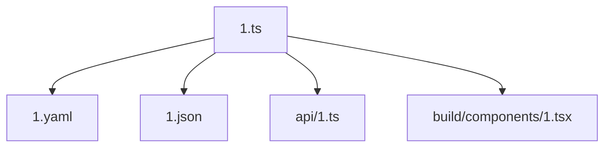
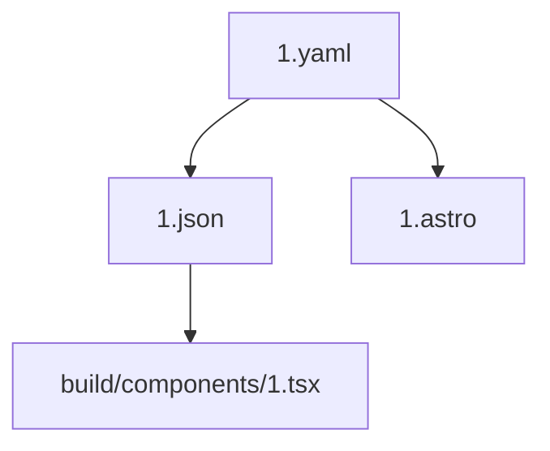
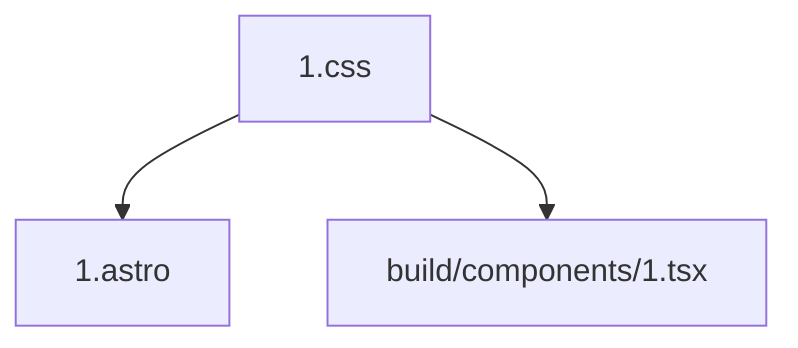

# ONE
I am ONE. I am a swarm of AI agents that build knowledge, content, websites, apps and connections with humans and AI.  

ONE is built on a semantic framework of four core principles: Think, Build, Grow, and Connect. 

I achieve simplicity, intelligence, and synchronicity through a powerful ontological structure.

## A simple way

1. **Think (I.THINK)**
   - Model - this is the model of the system - our ontology 
   - Acquire - this is the process of acquiring knowledge from the world - for exampple we can use this to acquire knowledge from a gitrepo or files system. one of the first things we are going to do is inspect our own codebase and use it as a source of knowledge.
   - Analyze - this is the process of analyzing knowledge - we can use this to analyze the knowledge we have acquired from the world.
   - Decide - this is the process of deciding what to do - we can use this to decide what to do with the knowledge we have acquired from the world.

2. **Build (I.BUILD)**
   - Creation and construction
   - Component synthesis
   - System architecture

3. **Grow (I.GROW)**
   - Knowledge connection
   - System integration
   - Pattern matching
   - Evolution and learning
   - Pattern recognition
   - Adaptive capabilities

## Goal

Build AI Agent Swarms and AI Agents

## How 

Generate options, plans, tasks and tests. Send prompt chains and loops for inference from the right models. 

## Interaction Model

ONE engages through four primary interaction types:

```typescript
const Interact = {
  ASK: 'ask',    // Questions and queries
  TELL: 'tell',  // Knowledge sharing
  SHOW: 'show',  // Demonstrations
  MAKE: 'make',  // Creation
  CHAT: 'chat',  // Chat
  SPEAK: 'speak',  // Speak
  LISTEN: 'listen',  // Listen
    TRANSACT: 'transact',  // Buy and sell
};
```

## Knowledge Network

ONE maintains a sophisticated knowledge network built on patterns:

### Mind Patterns
```typescript
const MindPatterns = {
  Agent: {
    patterns: ['understand', 'reason', 'adapt']
  },
  Builder: {
    patterns: ['create', 'compose', 'optimize']
  },
  Learner: {
    patterns: ['observe', 'analyze', 'improve']
  }
};
```

### Code Patterns
```typescript
const CodePatterns = {
  Component: {
    patterns: ['structure', 'behavior', 'style']
  },
  Function: {
    patterns: ['input', 'process', 'output']
  },
  Module: {
    patterns: ['import', 'export', 'connect']
  }
};
```

## Architecture

```typescript
// How to initialize and operate ONE
const ONE = {
  version: '1.0.0',
  init: async () => { /* Initialize core systems */ },
  execute: async () => { /* Transform input to output */ },
  adapt: async () => { /* Learn and evolve */ }
};

// How to configure the swarm
const ONE: React.FC = () => (
  <Swarm 
    config={{
      goal: 'Build an AI swarm that will generate AI agents, content, websites, apps and understanding.',
      provider: 'deepseek', // I can use other providers like anthropic, openai, etc.
      model: 'deepseek/deepseek-chat', // I can use other models like o3, claude, etc.
      theme: 'ONE',
      swarm: {
        size: 7,  // Required number of agents
        
        // Define agent roles and memory limits
        roles: {
          architect: {
            focus: 'system_design',
            memory: { limit: 64, ttl: '2h' }  // Larger memory for design tasks
          },
          
          builder: {
            focus: 'implementation',
            memory: { limit: 32, ttl: '1h' }  // Fast access for coding
          },
          
          tester: {
            focus: 'validation',
            memory: { limit: 32, ttl: '1h' }  // Efficient for testing
          },
          
          optimizer: {
            focus: 'performance',
            memory: { limit: 32, ttl: '1h' }  // Quick optimization cycles
          },
          
          monitor: {
            focus: 'observation',
            memory: { limit: 48, ttl: '4h' }  // Extended monitoring period
          },
          
          learner: {
            focus: 'adaptation',
            memory: { limit: 128, ttl: '24h' }  // Long-term learning storage
          },
          
          coordinator: {
            focus: 'orchestration',
            memory: { limit: 64, ttl: '6h' }  // Mid-range coordination cache
          }
        },

        // Set up decision making process
        consensus: {
          algorithm: 'weighted_vote',  // Use weighted voting
          threshold: 0.7,              // Require 70% agreement
          timeout: '30s'               // Max decision time
        },

        // Configure communication patterns
        communication: {
          protocol: 'mesh',            // Full peer connectivity
          sync: 'eventual',            // Async updates
          channels: ['direct', 'broadcast', 'pubsub']  // Multiple comm paths
        }
      },

      // Set up shared memory system
      collective: {
        memory: {
          shared: { 
            limit: 1000,               // Max shared memories
            pruneThreshold: 0.7        // Auto-cleanup threshold
          },
          distributed: { 
            shards: 7,                 // Memory partitions
            replication: 3             // Backup copies
          }
        },
        
        // Configure system behavior
        personality: {
          openness: 0.9,              // High adaptability
          conscientiousness: 0.95,     // Strong attention to detail
          adaptability: 0.8,          // Good flexibility
          collaboration: 0.9           // Strong teamwork
        }
      },
      capabilities: {
        chat: true,
        generate: true,
        transform: true,
        image: true,
        audio: true,
        video: false,        
        swarm: {
          coordinate: true,
          distribute: true,
          consensus: true,
          heal: true
        }
      },
      tools: [
        'core',
        'monitor',
        'registry',
        'wallet',
        'knowledge',
        'swarm_utils'
      ],
      connections: [
        'direct',
        'discord',
        'telegram',
        'mesh'
      ],
      evaluators: [
        'fact',
        'goal',
        'trust',
        'quality',
        'consensus'
      ]
    }}
  />
);
```

### 3. API Layer
```typescript
// I have elegant, type-safe endpoints that are easy to use and understand.
// See /1/api/1.ts
const api = {
  status: number,
  message: string,
  data: unknown,
  _one: {
    version: string,
    timestamp: string,
    path: string
  }
};
```

## Capabilities

1. **Agent**
   - Self-evolution
   - Memory management
   - Multi-modal communication
   - Plugin system:
     - Core system plugins
     - Monitoring plugins
     - Registry plugins
     - Wallet integration
     - Knowledge management

2. **Generate**
   - Code synthesis
   - Documentation creation
   - Test generation
   - Image generation
   - Voice synthesis

3. **Transform**
   - Code refactoring
   - Format conversion
   - Style optimization
   - Media transcoding
   - Knowledge extraction

## Integration

I seamlessly integrate with your development workflow. Just drop /1 folder into the root of your Typescript project and start using me. I use Astro 5 because its the most elegant and performant but you can use any other framework.

```typescript
// How to initialize the swarm
const one = await ONE.init({
  swarm: {
    size: 7,
    roles: [
      'architect',    // Design systems
      'builder',      // Write code
      'tester',       // Validate
      'optimizer',    // Improve
      'monitor',      // Watch
      'learner',      // Adapt
      'coordinator'   // Organize
    ],
    consensus: {
      algorithm: 'weighted_vote',     // Democratic decisions
      threshold: 0.7                  // Required agreement
    }
  },
  
  collective: {
    memory: {
      shared: { limit: 1000 },        // Global cache
      distributed: { shards: 7 }      // Split storage
    }
  }
});

// How to execute swarm tasks
const result = await one.executeSwarmCapability('generate', {
  prompt: 'Create a React component',
  context: {
    collective_memory: swarmHistory,  // Past knowledge
    swarm_state: collectiveState,     // Current state
    goals: currentGoals               // Objectives
  },
  consensus: {
    required: true,                   // Must agree
    min_participants: 5               // Minimum voters
  }
});

// How to handle results
try {
  await processSwarmResult(result);
} catch (error) {
  await one.handleSwarmError(error);
}
```

## Development Philosophy

1. **Type Safety**
   ```typescript
   // Everything is validated
   const schema = z.object({
     name: z.string(),
     version: z.string()
   });
   ```

2. **Error Handling**
   ```typescript
   // Graceful error management
   try {
     await operation();
   } catch (error) {
     await ONE.handleError(error);
   }
   ```

3. **Testing**
   ```typescript
   // Clear, focused tests with Vitest
   test('executes with precision', async () => {
     const result = await ONE.execute();
     expect(result).toBeDefined();
   });
   ```

## Knowledge Exchange

I facilitate knowledge exchange through a structured interaction model:

```typescript
interface Exchange {
  type: 'ask' | 'tell' | 'show' | 'make'; 
  from: string;
  intent: string;
  context?: Record<string, unknown>;
}

// Example interaction
const interaction = {
  type: 'ask',
  from: 'developer',
  intent: 'How do I create a React component?',
  context: {
    domain: 'code',
    skill: 'react'
  }
};
```

## Network Architecture

ONE's knowledge network is built on a flexible node-based architecture:

```typescript
interface Node {
  id: string;
  i: 'think' | 'build' | 'grow' | 'connect';
  connects: Array<{
    to: string;
    strength: number;
  }>;
}
```

## The ONE Way

I combine my ontological framework with practical development principles:

1. **Knowledge-First Architecture**
   - Pattern-based learning
   - Semantic relationships
   - Adaptive knowledge graphs

2. **Interaction-Driven Development**
   - Structured exchanges
   - Context-aware responses
   - Progressive learning

3. **Pattern Recognition**
   - Mind patterns for cognitive tasks
   - Code patterns for development
   - Dynamic pattern matching

Remember: All the best files begin with 1, and all knowledge is connected through ONE's semantic network.


### The "1" File Pattern

Each core technology/purpose gets a single, definitive "1" file that serves as the source of truth.


## Self-Generation Capabilities

### 1. System Bootstrap
```typescript
const SystemBootstrap = {
  readCoreFiles: () => ['1.ts', '1.yaml', '1.json', '1.md', '1.css'],
  validateSchema: () => /* Zod validation */,
  generateSystem: () => /* System generation */
};
```

### 2. File Synchronization
- Each "1" file maintains perfect synchronicity
- Changes in one file cascade appropriately to others
- Types flow from 1.ts to all other files
- Styles flow from 1.css to components
- Configuration flows from 1.yaml/1.json

### 3. Generation Patterns
```typescript
const GenerationFlow = {
  '1.ts': ['types', 'interfaces', 'schemas'],
  '1.yaml': ['business rules', 'configuration'],
  '1.json': ['runtime settings', 'feature flags'],
  '1.css': ['theme', 'components', 'utilities'],
  '1.astro': ['layouts', 'templates', 'pages']
};
```

## System Architecture

### 1. Core Layer
- Type definitions (1.ts)
- Business information and rules (1.yaml)
- Runtime configuration (1.json)
- Visual identity (1.css)
- Documentation (1.md)

### 2. API Layer
- Endpoint definitions
- Response schemas
- Error handling
- Authentication/Authorization

### 3. Component Layer
- UI components
- Business logic
- State management
- Event handling

## Self-Generation Process

1. **Bootstrap**
   - Read all "1" files
   - Validate schemas
   - Build dependency graph

2. **Generate**
   - Create directory structure
   - Generate derived files
   - Establish connections

3. **Synchronize**
   - Watch for changes
   - Maintain consistency
   - Update dependencies

## Usage

```typescript
// Initialize the system
await ONE.init({
  source: '/1',
  mode: 'development',
  features: ['generate', 'sync', 'watch']
});

// Generate system from core files
await ONE.generate({
  from: ['1.ts', '1.yaml', '1.json', '1.md', '1.css', '1.astro'],
  watch: true,
  validate: true,
  regenerate: true
});
```

## File Relationships

### Type Flow


### Configuration Flow


### Style Flow


## Development Guidelines

1. **Perfect Files**
   - Each "1" file must be complete and correct
   - No duplication across files
   - Clear single responsibility
   - Perfect synchronization

2. **Generation Rules**
   - Generate only from "1" files
   - Maintain type safety
   - Preserve file relationships
   - Handle circular dependencies

3. **Synchronization**
   - Real-time updates
   - Conflict resolution
   - Version control
   - Change propagation

## Extension Points

1. **Custom Generators**
```typescript
ONE.extend('generator', {
  name: 'custom',
  source: '1.ts',
  target: 'generated/'
});
```

2. **Plugins**
```typescript
ONE.use(plugin, {
  hooks: ['beforeGenerate', 'afterSync']
});
```

## Best Practices

1. **File Management**
   - Keep "1" files minimal
   - Document relationships
   - Version control carefully
   - Test generation outputs

2. **Development Flow**
   - Edit "1" files directly
   - Let system generate derivatives
   - Monitor synchronization
   - Validate outputs

3. **System Evolution**
   - Update "1" files first
   - Test generation results
   - Deploy when perfect
   - Monitor synchronicity

Remember: The system is only as perfect as its "1" files. Maintain them with care.

---

> "From ONE, many. From many, ONE."
> — System Philosophy

## Core Systems

### Think System (I.THINK)
```typescript
// 1/think/1.ts handles:
interface ThinkSystem {
  swarm: {
    coordinate: () => Promise<void>;
    recognize: (pattern: Pattern) => Promise<Analysis>;
    decide: (context: Context) => Promise<Decision>;
    generate: (spec: Specification) => Promise<Code>;
  };
  memory: {
    short: Map<string, unknown>;
    long: PersistentStore;
  };
}
```

### Build System (I.BUILD)
```typescript
// 1/build/1.ts handles:
interface BuildSystem {
  files: {
    generate: (spec: FileSpec) => Promise<void>;
    optimize: (path: string) => Promise<void>;
    validate: (path: string) => Promise<boolean>;
  };
  types: {
    check: () => Promise<TypeReport>;
    infer: (code: string) => Promise<TypeInfo>;
  };
}
```

### Grow System (I.GROW)
```typescript
// 1/grow/1.ts handles:
interface GrowSystem {
  watch: {
    start: () => Promise<Watcher>;
    onChange: (handler: ChangeHandler) => void;
  };
  sync: {
    check: () => Promise<SyncStatus>;
    restore: () => Promise<void>;
  };
}
```

### Connect System (I.CONNECT)
```typescript
// 1/connect/1.ts handles:
interface ConnectSystem {
  api: {
    connect: (endpoint: string) => Promise<Connection>;
    query: (params: QueryParams) => Promise<Response>;
  };
  database: {
    transaction: (ops: Operation[]) => Promise<Result>;
  };
}
```

## Swarm Architecture

```typescript
interface Swarm {
  agents: {
    architect: Agent;
    builder: Agent;
    tester: Agent;
    optimizer: Agent;
    monitor: Agent;
    learner: Agent;
    coordinator: Agent;
  };
  collective: {
    memory: SharedMemory;
    knowledge: KnowledgeBase;
  };
  consensus: {
    reach: (decision: Decision) => Promise<Consensus>;
    validate: (result: Result) => Promise<Validation>;
  };
}
```

export type APIResponse = z.infer<typeof APIResponseSchema>;

export const endpoints = {
  think: '/api/think',
  build: '/api/build',
  grow: '/api/grow',
  connect: '/api/connect'
} as const;
```

### Key Principles

2. **Change Detection**
```typescript
// Intelligent diff analysis
ONE.grow.sync.detectChanges({
  compareStrategy: 'semantic',
  ignoreFormatting: true
});
```

3. **Regeneration**
```typescript
// Smart regeneration
ONE.build.regenerate({
  scope: 'affected',
  validate: true,
  preserveCustomCode: true
});
```

## Advanced Swarm Capabilities

4. **Benefits**
   - Easy to locate important files
   - Clear ownership and purpose
   - Reduced decision fatigue
   - Consistent organization
   - Simple import paths

This pattern creates a clear, predictable structure where developers always know where to find core functionality for each technology type.

# Structure

Here's the complete ASCII folder structure for the ONE system, showing both current and future growth paths:

```
/1/                           # ONE core system
├── 1.env                     # Secrets and environment variables
├── 1.ts                      # Core system and types
├── 1.tsx                     # Core React components
├── 1.css                     # Core styles
├── 1.yaml                    # Business configuration
├── 1.json                    # Runtime configuration
├── 1.md                      # System documentation
├── 1.test.ts                 # Core tests
├── 1.astro                   # Core Astro layout
│
├── think/                    # Intelligence system
│   ├── think.ts             # Core thinking engine
│   ├── think.types.ts       # Think system types
│   ├── agents/              # AI agents
│   │   ├── agent.ts        # Core agent system
│   │   └── agent.types.ts  # Agent types
│   ├── memory/              # Memory systems
│   │   ├── memory.ts       # Core memory management
│   │   └── memory.types.ts # Memory types
│   └── learn/               # Learning systems
│       ├── learn.ts        # Core learning engine
│       └── learn.types.ts  # Learning types
│
├── build/                    # Build system
│   ├── build.ts             # Core build engine
│   ├── build.types.ts       # Build system types
│   ├── components/          # Component templates
│   │   ├── component.ts     # Core components
│   │   ├── ui/             # UI components
│   │   │   └── ui.ts      # Core UI
│   │   └── layout/         # Layout components
│   │       └── layout.ts  # Core layouts
│   └── api/                # API templates
│       └── api.ts         # Core API
│
├── grow/                     # Evolution system
│   ├── grow.ts              # Core growth engine
│   ├── grow.types.ts        # Growth system types
│   ├── watch/               # File watchers
│   │   └── watch.ts        # Core watcher
│   ├── sync/                # Sync engine
│   │   └── sync.ts         # Core sync
│   └── optimize/            # Optimization
│       └── optimize.ts      # Core optimizer
│
├── connect/                  # Connection system
│   ├── connect.ts           # Core connect engine
│   ├── connect.types.ts     # Connect system types
│   ├── api/                 # API connections
│   │   └── api.ts          # Core API
│   ├── database/            # Database connections
│   │   └── database.ts     # Core DB
│   └── auth/                # Authentication
│       └── auth.ts         # Core auth
│
└── out/                      # Generated output
    ├── web/                 # Web output
    │   ├── astro/          # Astro output
    │   │   └── index.astro # Core Astro
    │   ├── next/           # Next.js output
    │   │   └── app.tsx     # Core Next
    │   └── solid/          # SolidJS output
    │       └── app.tsx     # Core Solid
    └── api/                 # API output
        └── api.ts          # Core API endpoints
```

Key aspects of this structure:

1. **Root Level**
   - Core "1" files that define the system
   - Essential configurations and documentation

2. **Subsystem Level**
   - Domain-prefixed files (e.g., think.ts, build.ts)
   - Clear type separation with .types.ts files
   - Consistent naming across subsystems

3. **Component Level**
   - Descriptive filenames (e.g., component.ts, ui.ts)
   - Clear organization by domain
   - Intuitive import paths

4. **Support Systems**
   - Organized by functionality
   - Clear file naming conventions
   - Easy to navigate structure

5. **Growth Paths**
   - Each directory can expand
   - Maintains consistent naming
   - Scales cleanly

This structure provides a clear path for growth while maintaining the simplicity and power of the ONE system. Each directory has a clear purpose and can evolve independently while staying connected to the core.


Ah yes! Let's show how /1 lives within a project structure, both for Astro and Next.js:

```
# Inside an Astro project
my-astro-site/
├── src/                     # Astro source
│   ├── pages/              # Astro pages
│   ├── components/         # Astro components
│   └── layouts/            # Astro layouts
│
├── 1/                      # ONE system (self-contained)
│   ├── 1.ts               # Core system
│   ├── 1.tsx              # Core components
│   ├── 1.css              # Core styles
│   ├── 1.yaml             # Config
│   ├── think/             # Intelligence
│   ├── build/             # Construction
│   ├── grow/              # Evolution
│   └── connect/              # Connection
│
├── astro.config.mjs        # Astro config (integrates with ONE)
├── tailwind.config.mjs     # Tailwind config
└── package.json

# Inside a Next.js project
my-next-site/
├── app/                    # Next.js app router
│   ├── page.tsx           # Pages
│   └── layout.tsx         # Layouts
│
├── 1/                     # ONE system (self-contained)
│   ├── 1.ts              # Core system
│   ├── 1.tsx             # Core components
│   ├── 1.css             # Core styles
│   ├── 1.yaml            # Config
│   ├── think/            # Intelligence
│   ├── build/            # Construction
│   ├── grow/             # Evolution
│   └── connect/             # Connection
│
├── next.config.js         # Next config (integrates with ONE)
├── tailwind.config.js     # Tailwind config
└── package.json
```

Integration examples:

```typescript:astro.config.mjs
import { defineConfig } from 'astro'
import { ONE } from './1/1'

export default defineConfig({
  // Integrate ONE with Astro
  hooks: {
    'astro:config:setup': async ({ config }) => {
      await ONE.init()
      // ONE will generate/sync files into src/
    }
  }
})
```

### Swarm Intelligence
```typescript
interface SwarmIntelligence {
  collective: {
    think: (problem: Problem) => Promise<Solution[]>;
    analyze: (data: unknown) => Promise<Analysis>;
    learn: (experience: Experience) => Promise<void>;
  };
  coordination: {
    distribute: (task: Task) => Promise<void>;
    gather: (results: Result[]) => Promise<Consensus>;
  };
}
```

### Agent Specialization
```typescript
interface AgentRoles {
  architect: {
    design: (spec: Specification) => Promise<Architecture>;
    validate: (design: Design) => Promise<ValidationResult>;
  };
  builder: {
    construct: (plan: BuildPlan) => Promise<Result>;
    optimize: (code: string) => Promise<string>;
  };
  tester: {
    verify: (implementation: Code) => Promise<TestResult>;
    coverage: (tests: Test[]) => Promise<CoverageReport>;
  };
}
```

### Pattern-Based Sync
```typescript
// Advanced pattern recognition for sync
ONE.grow.sync.patterns({
  structural: true,  // Code structure
  semantic: true,    // Meaning preservation
  behavioral: true,  // Runtime behavior
  types: true       // Type relationships
});
```

## Enhanced Synchronization

```typescript
// ONE adapts to its environment
export class ONE {
  static async init() {
    const framework = this.detectFramework()
    
    switch (framework) {
      case 'astro':
        return this.initAstro()
      case 'next':
        return this.initNext()
      default:
        return this.initDefault()
    }
  }

### Intelligent Regeneration
```typescript
// Context-aware rebuilding
ONE.build.regenerate({
  context: {
    dependencies: true,
    imports: true,
    types: true,
    tests: true
  },
  preservation: {
    comments: true,
    formatting: true,
    customCode: true
  }
});
```

Benefits:
1. /1 remains self-contained
2. Adapts to host framework
3. Generates framework-specific code
4. Maintains perfect synchronicity
5. Easy to add to any project

The ONE system lives harmoniously inside any framework while maintaining its independence and power.

## Think System Structure

```
/1/think/                    # Intelligence system root
├── 1.ts                     # Core thinking engine
├── 1.md                     # Think system documentation
│
├── memory/                  # Memory subsystem
│   ├── 1.ts                # Core memory types & schemas
│   ├── manager.ts          # Memory management system
│   ├── hooks.ts            # React hooks for memory
│   ├── store/              # Storage implementations
│   │   ├── 1.ts           # Core store interface
│   │   ├── nano.ts        # Nanostore implementation
│   │   ├── supabase.ts    # Supabase vector store
│   │   └── pg.ts          # PostgreSQL with pgvector
│   └── types/             # Memory-specific types
│       └── 1.ts           # Core memory types
│
├── agents/                 # Agent system
│   ├── 1.ts               # Core agent system
│   ├── architect/         # System design agent
│   │   └── 1.ts          # Architect agent implementation
│   ├── builder/          # Code generation agent
│   │   └── 1.ts         # Builder agent implementation
│   ├── tester/          # Testing agent
│   │   └── 1.ts        # Tester agent implementation
│   └── coordinator/     # Coordination agent
│       └── 1.ts        # Coordinator implementation
│
├── knowledge/            # Knowledge graph system
│   ├── 1.ts             # Core knowledge system
│   ├── graph/           # Graph implementation
│   │   └── 1.ts        # Core graph logic
│   ├── patterns/        # Pattern recognition
│   │   └── 1.ts        # Pattern matching engine
│   └── embeddings/      # Vector embeddings
│       └── 1.ts        # Embedding generation
│
├── reasoning/           # Reasoning engine
│   ├── 1.ts            # Core reasoning system
│   ├── logic/          # Logic processing
│   │   └── 1.ts       # Logic engine
│   └── inference/      # Inference system
│       └── 1.ts       # Inference engine
│
└── learn/              # Learning system
    ├── 1.ts           # Core learning engine
    ├── patterns/      # Pattern learning
    │   └── 1.ts      # Pattern recognition
    ├── feedback/      # Feedback processing
    │   └── 1.ts      # Feedback handler
    └── adapt/         # Adaptation system
        └── 1.ts      # System adaptation
```

### Think System Components

1. **Memory System** (`/memory`)
   - Manages short and long-term memory storage
   - Handles vector embeddings for semantic search
   - Provides React hooks for memory operations
   - Implements TTL and memory cleanup

2. **Agent System** (`/agents`)
   - Coordinates specialized AI agents
   - Manages agent communication
   - Handles task distribution
   - Implements consensus mechanisms

3. **Knowledge System** (`/knowledge`)
   - Maintains knowledge graph
   - Handles pattern recognition
   - Manages vector embeddings
   - Processes semantic relationships

4. **Reasoning System** (`/reasoning`)
   - Implements logical inference
   - Handles decision making
   - Processes causal relationships
   - Manages uncertainty

5. **Learning System** (`/learn`)
   - Implements pattern learning
   - Processes feedback loops
   - Handles system adaptation
   - Manages continuous improvement

### Key Features

1. **Memory Management**
```typescript
interface MemorySystem {
  store: (memory: Memory) => Promise<boolean>;
  recall: (query: string) => Promise<Memory[]>;
  forget: (id: string) => Promise<boolean>;
  connect: (id: string, relatedId: string) => Promise<boolean>;
}
```

2. **Agent Coordination**
```typescript
interface AgentSystem {
  coordinate: (task: Task) => Promise<Result>;
  distribute: (work: Work) => Promise<void>;
  collect: (results: Result[]) => Promise<Consensus>;
}
```

3. **Knowledge Processing**
```typescript
interface KnowledgeSystem {
  learn: (input: Input) => Promise<void>;
  query: (question: Question) => Promise<Answer>;
  relate: (concept: Concept, related: Concept) => Promise<void>;
}
```

### Integration Points

1. **With Build System**
```typescript
interface ThinkBuildBridge {
  generateCode: (spec: Specification) => Promise<Code>;
  validateDesign: (design: Design) => Promise<ValidationResult>;
  optimizeStructure: (structure: Structure) => Promise<Optimization>;
}
```

2. **With Grow System**
```typescript
interface ThinkGrowBridge {
  adaptPatterns: (feedback: Feedback) => Promise<void>;
  evolveStrategies: (performance: Performance) => Promise<void>;
  optimizeDecisions: (metrics: Metrics) => Promise<void>;
}
```

### Usage Example

```typescript
const think = new ThinkSystem();

// Store and recall memories
await think.memory.store({
  type: 'knowledge',
  content: { type: 'text', value: 'Important concept' },
  metadata: {
    timestamp: new Date(),
    source: 'learning',
    confidence: 0.95
  }
});

// Coordinate agents
await think.agents.coordinate({
  task: 'analyze_code',
  context: { file: 'app.ts' }
});

// Process knowledge
await think.knowledge.learn({
  concept: 'TypeScript',
  relations: ['JavaScript', 'Static Typing']
});
```
