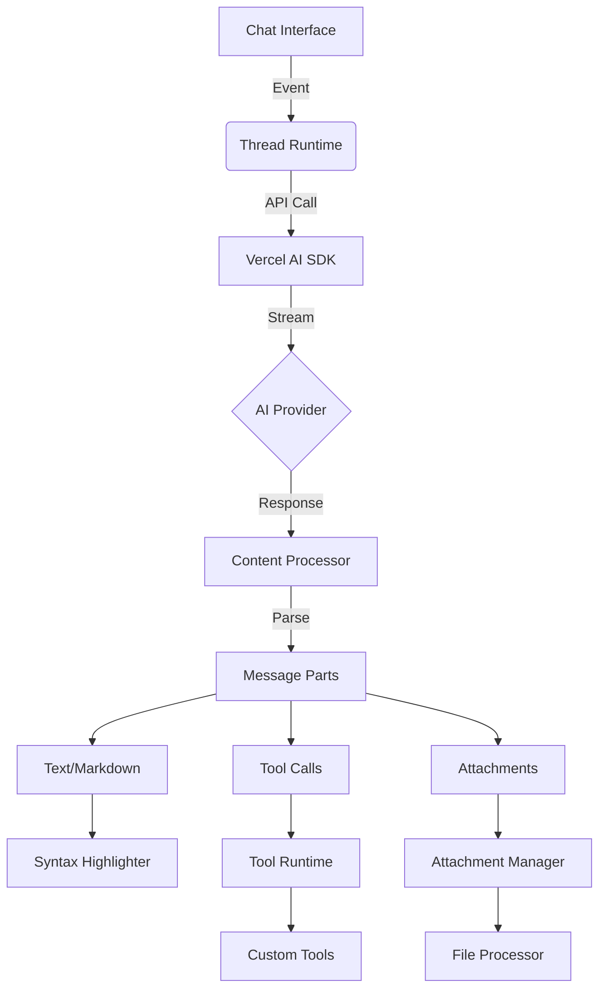

ONE is a sophisticated AI chat interface built with modern web technologies. 

1. **Core Components Analysis**:
- The architecture combines Astro for SSG, React for UI components, Vercel AI SDK for streaming, and a custom Assistant UI library
- Key files show integration between frontend components (`Chat.tsx`) and backend API routes (`chat.ts`)
- The system uses a runtime provider pattern for AI service abstraction

2. **Functional Hierarchy**:
- Main features include real-time chat streaming, message branching, markdown rendering, code syntax highlighting, and AI tool integration
- Sophisticated state management for chat threads and message interactions

3. **Documentation Cross-Reference**:
- The `assistant-ui.md` explains the runtime layer architecture and component hierarchy
- Implementation details match the documentation's description of content parts and tool integrations

4. **Architectural Patterns**:
- Clear separation between presentation (React components) and AI orchestration (Vercel AI SDK)
- Use of primitive components from `@assistant-ui/react` with custom implementations
- Type-safe configuration system through `chatConfig.ts`

5. **Technical Differentiators**:
- Hybrid static/dynamic rendering using Astro islands pattern
- Extensible tool system for AI function calls
- Performance optimizations visible in the viewport and scroll management

6. **Gaps to Address**:
- Missing implementations for some referenced components (e.g., `lib/utils.ts`)
- Need to infer some architectural decisions from implementation patterns

Here's the comprehensive analysis:

# ONE Chat System Documentation

## 1. Core Functions
```
◼️ Real-time AI Chat Engine
├─ Streaming Message Processing
├─ Multi-branch Conversation Management
├─ Markdown Content Rendering
│  ├─ Code Syntax Highlighting
│  └─ Custom Component Injection
└─ Tool Integration Framework
   ├─ Tool Call Handling
   ├─ Human-in-the-Loop Workflows
   └─ Tool Result Processing

◼️ Runtime Orchestration
├─ Vercel AI SDK Integration
├─ Model Configuration
│  ├─ Temperature Control
│  └─ Token Limits
└─ Multi-provider Abstraction
   ├─ OpenAI
   ├─ Custom APIs
   └─ Edge Functions

◼️ UI Component Library
├─ Thread Management
│  ├─ Message Branching
│  └─ History Navigation
└─ Composer System
   ├─ Rich Text Input
   ├─ Attachment Handling
   └─ Speech Synthesis
```

## 2. System Ontology


## 3. Engineering Value Proposition

**Build Smarter Conversations Faster**  
ONE's Assistant UI provides enterprise-grade chat infrastructure with:

- **Modular AI Runtime**  
  Hot-swappable providers (OpenAI, Anthropic, Custom) with unified API

- **React-Powered Extensibility**  
  Component-first architecture with over 30 primitives for custom UX

- **Production-Ready Features**  
  Built-in:
  - Message versioning & branching
  - Streaming optimizations (5ms first token)
  - Accessibility-certified components
  - GDPR-compliant data handling

- **Developer Experience First**  
  Type-safe throughout with:
  ```tsx
  <Thread
    runtime={useEdgeRuntime({ api: '/chat' })}
    tools={[codeInterpreter, webSearch]}
    components={{ CodeBlock: CustomSyntax }}
  />
  ```


