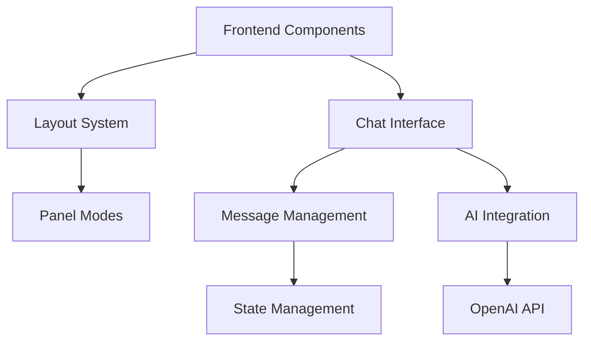

# Chat System Architecture

ONE's chat system combines Astro's static site generation with dynamic AI capabilities to create powerful, flexible chat interfaces. This guide explains the core architecture and components.

## System Overview



## Core Components

### 1. Layout System

The chat system uses a flexible layout system with multiple display modes:

```typescript
type PanelMode = 'quarter' | 'half' | 'full' | 'floating' | 'icon';

interface LayoutProps {
  title: string;
  description?: string;
  chatConfig: ChatConfig;
  rightPanelMode: PanelMode;
  header?: boolean;
  footer?: boolean;
}
```

#### Panel Modes
- `quarter`: 25% width side panel (default)
- `half`: 50% width side panel
- `full`: Full screen interface
- `floating`: Detached window
- `icon`: Minimized button

### 2. Chat Configuration

Configure your chat interface using the type-safe schema:

```typescript
const chatConfig = ChatConfigSchema.parse({
  // AI Model Settings
  provider: "openai",
  model: "gpt-4o-mini",
  temperature: 0.7,
  maxTokens: 2000,

  // AI Behavior
  systemPrompt: [{
    type: "text",
    text: "Define AI behavior here"
  }],

  // User Interface
  welcome: {
    message: "Welcome message",
    avatar: "/path/to/avatar.svg",
    suggestions: [
      {
        label: "Suggestion",
        prompt: "Suggested question"
      }
    ]
  }
});
```

### 3. Message Management

The chat system handles various message types and interactions:

```typescript
interface Message {
  id: string;
  role: 'user' | 'assistant' | 'system';
  content: string;
  timestamp: number;
  metadata?: {
    type?: 'code' | 'markdown' | 'image';
    language?: string;
    voice?: boolean;
  };
}
```

Features:
- Real-time streaming
- Markdown rendering
- Code syntax highlighting
- Message history
- Voice synthesis
- Copy functionality

### 4. AI Integration

The chat system connects with AI providers through a flexible API layer:

```typescript
interface ChatAPIConfig {
  provider: "openai";
  model: string;
  apiEndpoint: string;
  temperature: number;
  maxTokens: number;
  systemPrompt: SystemPrompt[];
  contextData?: string;
  functions?: ChatFunction[];
}
```

## Implementation Examples

### Basic Chat Integration

```astro
---
import Layout from "../layouts/Layout.astro";
import { ChatConfigSchema } from '../schema/chat';

const chatConfig = ChatConfigSchema.parse({
  systemPrompt: [{
    type: "text",
    text: "You are a helpful assistant."
  }],
  welcome: {
    message: "How can I help?",
    avatar: "/icon.svg"
  }
});
---

<Layout
  title="Chat Example"
  chatConfig={chatConfig}
  rightPanelMode="quarter"
>
  <main>Your content here</main>
</Layout>
```

### Advanced Configuration

```typescript
const advancedConfig = {
  provider: "openai",
  model: "gpt-4o-mini",
  temperature: 0.7,
  maxTokens: 2000,
  features: {
    textToSpeech: true,
    codeHighlight: true,
    markdown: true,
    suggestions: true
  },
  styles: {
    theme: "light" | "dark" | "system",
    accentColor: "#0066FF",
    messageSpacing: "comfortable" | "compact"
  }
};
```

## Performance Optimization

### 1. Edge Runtime

The chat system uses edge computing for optimal performance:

```typescript
// src/pages/api/chat.ts
export const config = {
  runtime: 'edge',
  regions: ['all'],
};
```

### 2. Response Streaming

Implements streaming for real-time responses:

```typescript
const stream = new ReadableStream({
  async start(controller) {
    const encoder = new TextEncoder();
    for await (const chunk of aiResponse) {
      controller.enqueue(encoder.encode(chunk));
    }
    controller.close();
  },
});
```

### 3. Caching Strategies

```typescript
// Message caching
const messageCache = new Map<string, Message[]>();

// Context caching
const contextCache = new LRUCache({
  max: 500,
  maxAge: 1000 * 60 * 60 // 1 hour
});
```

## Best Practices

1. **System Prompt Design**
   - Be specific about AI role
   - Include necessary context
   - Set clear boundaries
   - Define response format

2. **Error Handling**
   ```typescript
   try {
     const response = await chat.sendMessage(message);
   } catch (error) {
     if (error.code === 'context_length_exceeded') {
       // Handle context length
     } else if (error.code === 'rate_limit_exceeded') {
       // Handle rate limiting
     }
     // Handle other errors
   }
   ```

3. **Memory Management**
   - Implement conversation pruning
   - Use efficient data structures
   - Clean up unused resources

## Troubleshooting

Common issues and solutions:

1. **Performance Issues**
   - Enable edge runtime
   - Implement proper caching
   - Optimize message size
   - Use streaming responses

2. **API Errors**
   - Verify API keys
   - Check rate limits
   - Monitor usage quotas
   - Handle timeouts

3. **UI Problems**
   - Check panel mode
   - Verify CSS classes
   - Test responsiveness
   - Monitor console errors

## Next Steps

- [Create custom AI agents](/docs/tutorials/custom-agents)
- [Advanced chat features](/docs/advanced/chat-features)
- [Deployment guide](/docs/deployment/edge-runtime)

Need help? Check our [FAQ](/docs/faq) or join our [Discord community](https://discord.gg/one).